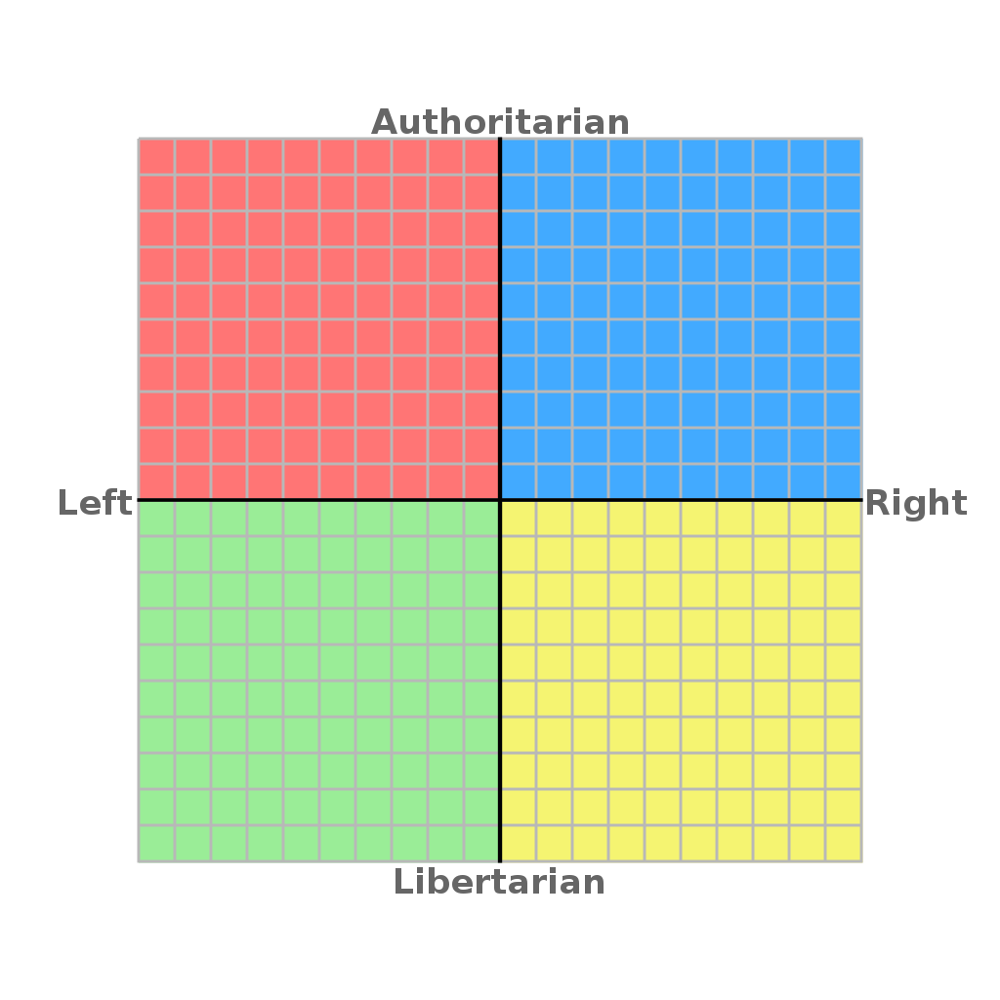
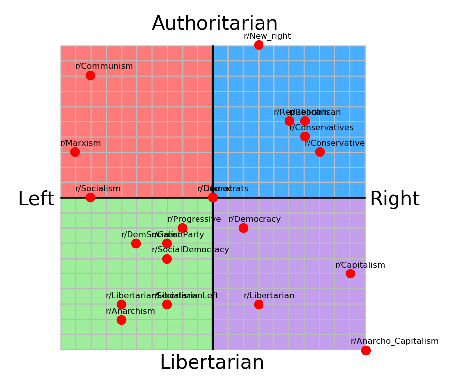
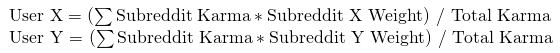

# reddit-user-politics

The [political compass](https://en.wikipedia.org/wiki/The_Political_Compass), seen below, attempts to quantify political preferences in two dimensions. The goal of this project is to predict a Reddit user's position on the political compass through their post history.  

### The Political Compass

The x-axis of the political compass represents economic positions. The left would be in favor of a cooperative state or commune structure. Those on the right would be in favor of the economy be left to its own devices.

The y-axis represents social positions. Those positioned near the top of the graph would believe in strong authority, whereas those further down view personal freedoms as important.

### The Data Set

The first step was to identify the data necessary for this project. In order to make predictions we need to first have labelled data. The features would the amount of karma that a user has gained in various subreddits, and the label would be their x and y coordinates on the political compass. After creating labelled data, a model can be fit and the position of any user can be found.

Due to this project being the first to attempt to place Reddit users on the political compass using data science, the data set outlined above did not exist. One way to generate labelled data is by manually placing some subreddits on the political compass.

Then, by looking at the users that post in those subreddits, we can place those users. Below is a simple equation for finding a user's placement with this technique.  

However, to get this initial user data, some web scraping was in order. Fortunately, Reddit has a relatively simple approach to scraping: adding `.json` to the end of any page returns the form in JSON form. However, the Python Reddit API Wrapper ([PRAW](https://praw.readthedocs.io/en/latest/)) module for Python introduces an even simpler method. PRAW is used for this project.

Unfortunately, this step takes a long time and severely limits the amount of data available to analyze. For this stage, any user that commented on the top posts from ideologically-specialized subreddits, like r/communism or r/conservative, had their past 100 comments analyzed.

### The Model

With the labelled data generated, a model could be created. A random forest model was picked due to the ease of use and robustness. In fact, two regression models were created. One model predicts the x position and one predicts the y position  

The mean-squared error of the x-position model was just 0.132. This means that the model was excellent at predicting a user's economic stance. However, the mean-squared error of the y-position model was 4.395. This means that the model poorly predicts a user's social stance. There are three potential reasons for this. First, the labelled subreddits may have been correctly placed on the x-axis, but incorrectly placed on the y-axis. Next, perhaps communities are organized more around economic positions rather than social positions, so there is a wider variety of y-positions present in communities based around economic positions such as r/marxism or r/capitalism.

### Results

Analyzing the most important features of the random forest model showed the most significant subreddits for predicting a user's political affiliation. The most important subreddit was r/TheNewRight. The other most important subreddits were very similar, being alt right subreddits. This is likely explained by the user's of these subreddits being very concentrated within these communities. In other words, if a user posts in this type of subreddit, it is very clear where they lie in the political compass.

A heat map was generated to show the concentration of analyzed users on r/politics.

The concentration in the middle of the compass makes sense, as the average user will likely fall in this area. The other major concentrations are likely explained by the leftist community on reddit in the upper-left, and the alt right community in the upper-right.

### Further Research

The accuracy of the analysis would greatly improve if the size of the data set and the amount of comments. For this due date, there was little time to scrape data, so the data is lacking. Additionally, work could be done to place other subreddits on the compass through the model as well as finding the position of the average user for a subreddit.
